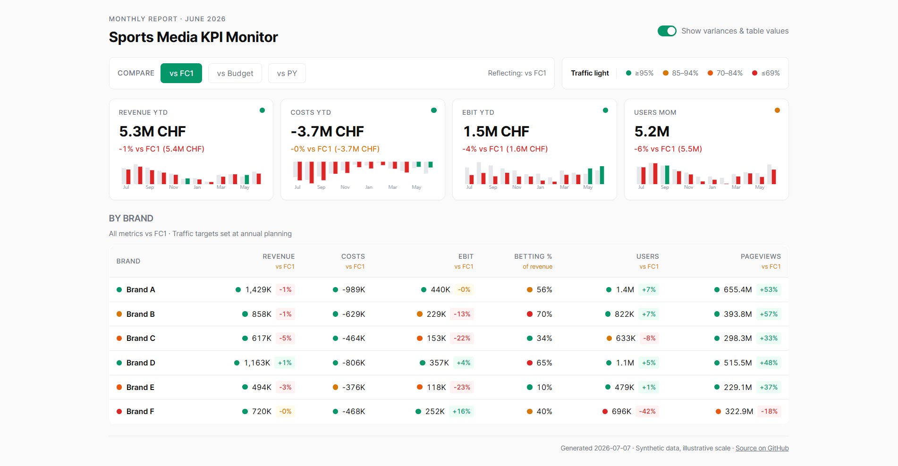
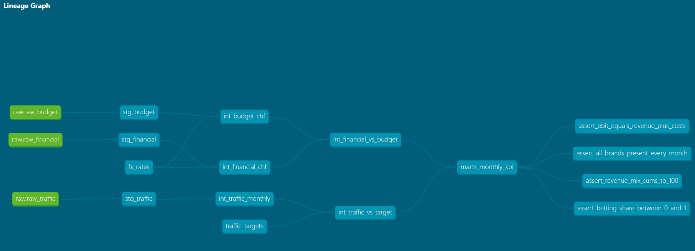

# Sports Media KPI Monitor

Every month the CEO and six brand MDs at a European sports media group open one page and see whether the business is on plan. This is the public, anonymized rebuild of that page.

Real names removed, revenue numbers scrambled with a fixed seed, brands renamed A through F. Everything else works the same as production.

**Live report**: [panagiotis-sourilas.github.io/sports-media-kpi-monitor](https://panagiotis-sourilas.github.io/sports-media-kpi-monitor/)



## What it does

- Reads a monthly financial export (SAP-style), a frozen annual budget, and daily traffic (GA4-style).
- Cleans and models in dbt on BigQuery.
- Renders a static HTML page: revenue and EBIT vs FC1/Budget/PY, traffic vs annual-planning targets, revenue mix, all normalized to CHF.
- Publishes to GitHub Pages. Anyone with the link opens it in the browser.

No BI tool. No dashboard subscription. It's a page.

## Stack

| Layer | Choice | Why not the obvious alternative |
|---|---|---|
| Ingestion | Python + GCS file drops | [Not Fivetran](docs/decisions/0001-why-not-fivetran.md) |
| Warehouse | BigQuery | [Not Snowflake](docs/decisions/0004-why-bigquery.md) |
| Transform | dbt | [Not Python transforms](docs/decisions/0005-why-dbt.md) |
| Serve | Static HTML on GitHub Pages | [Not Looker or Metabase](docs/decisions/0003-why-static-html-not-bi-tool.md) |
| Orchestrate | Manual for now, GitHub Actions next | [Not Airflow](docs/decisions/0002-why-not-airflow.md) |

The pattern: every layer picks the cheapest thing that works. Then explains why we didn't buy the modern default. Those explanations are the point — [see the ADRs](docs/decisions/).

## Pipeline



Three raw sources plus two seeds flow through staging → intermediate → marts. The final mart feeds the report and four data-quality tests catch drift before it reaches the reader.

The whole chain runs on GitHub Actions on the 2nd of each month — see [`.github/workflows/monthly-refresh.yml`](.github/workflows/monthly-refresh.yml). It authenticates to BigQuery with a stored service-account key, rebuilds the marts, re-renders the HTML, and commits the fresh page back to master. GitHub Pages picks up the update automatically.

## Quickstart

You need Python 3.12 (dbt-bigquery doesn't support 3.13+ yet) and a GCP project with BigQuery access.

```bash
# 1. Set up
py -3.12 -m venv .venv && .venv\Scripts\activate    # Windows
pip install dbt-bigquery google-cloud-bigquery jinja2

# 2. Point at your GCP project
export GOOGLE_APPLICATION_CREDENTIALS=/path/to/service-account.json

# 3. Generate synthetic data and load it
python ingestion/synthetic_data/generate.py --out raw
python ingestion/load_to_bigquery.py

# 4. Build the models
cd dbt && dbt seed && dbt run && dbt test && cd ..

# 5. Render the HTML report
python serving/render.py    # writes docs/index.html
```

Open `docs/index.html` in a browser.

## Where to look

- [`docs/architecture.md`](docs/architecture.md) — the whole pipeline in one diagram
- [`docs/decisions/`](docs/decisions/) — why each tool, why not the alternatives
- [`docs/portfolio.md`](docs/portfolio.md) — what this is meant to show, and what it isn't
- [`dbt/`](dbt/) — the actual models (staging → intermediate → marts)
- [`serving/`](serving/) — the render script + Jinja template
- [`ingestion/`](ingestion/) — synthetic data generator + BigQuery loader

## The real version

Built for a real company. The production one runs monthly, feeds the exec team, uses live financials from SAP FC1 and GA4 across six brands in six countries. This repo is the same pipeline rebuilt without the confidential parts, so the design is visible without the numbers.
